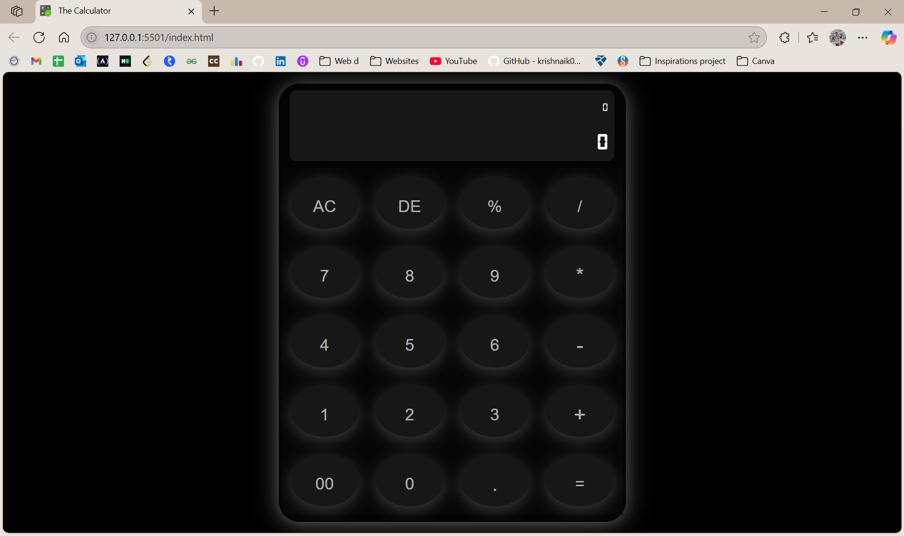
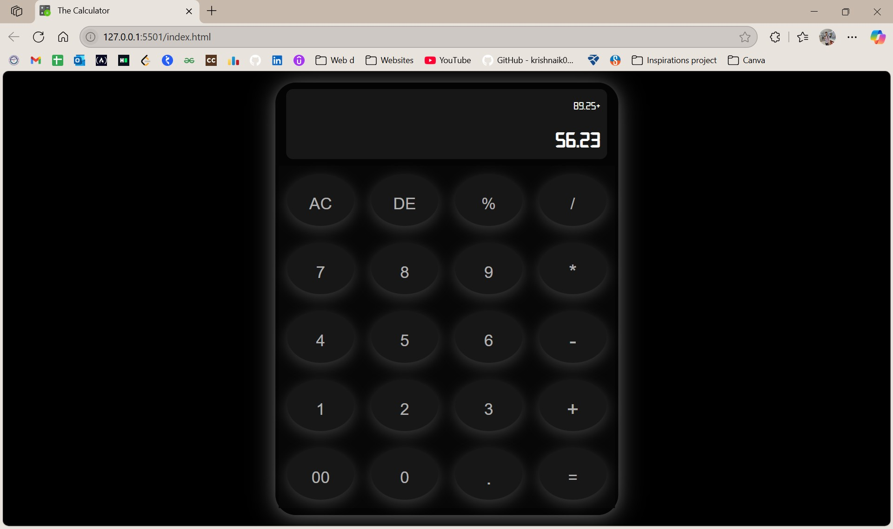

# Calculator

A fully functional and responsive calculator built with **HTML**, **CSS**, and **JavaScript**. It supports all basic arithmetic operations, decimal numbers, and includes features like delete (backspace) and clear all.

---

## Features

- Perform addition (+), subtraction (−), multiplication (×), division (÷), and modulo (%)
- Supports decimal calculations
- Keyboard input support
- Clear All button to reset input
- Delete button to remove the last entry
- Responsive UI for desktop, tablet, and mobile
- Built with vanilla JavaScript (no external libraries)

---

## Tech Stack

- **HTML** – Structure and layout
- **CSS** – Styling and responsive design
- **JavaScript** – Functionality and logic

---

## File Structure

```
calculator/
├── index.html      # Main HTML file
├── style.css       # CSS for styling
└── script.js       # JavaScript for logic
```

---

## How to Use

1. **Clone the repository:**
    ```bash
    git clone https://github.com/chaitanyaraj75/calculator.git
    cd calculator
    ```
2. **Open `index.html` in your browser.**

---

## Screenshots

**Calculator**



**Calculation**



**Result**


---

## Future Changes

- Calculation history
- Dark/light theme toggle
- Scientific calculator mode

---

## Author

Made by **Chaitanya Raj**.
